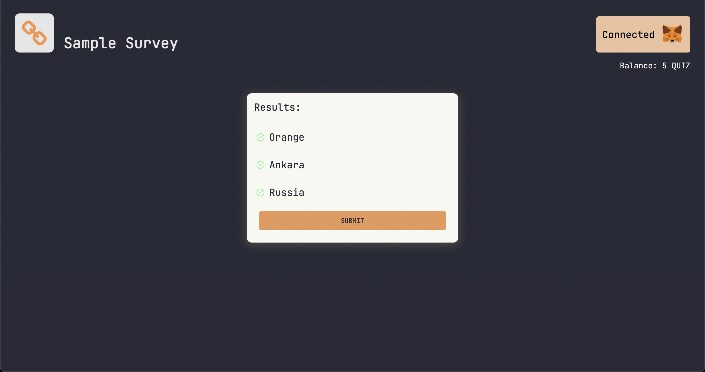

# Rather Labs Trivia Challenge

#### Description
The challenge is to create a dynamic trivia so that users can participate and be awarded with tokens.

### Project initialization

To start with this project, first clone this repo and run the following command:

```
yarn install
```

For the environment variables create an **.env** file with the following keys

```
NEXT_PUBLIC_ETHER_SCAN_TOKEN=<your etherscan api token>
NEXT_PUBLIC_API_URL_ROPSTEN=<the network, in this case a testing one>
```

To get an etherscan token click [here](https://etherscan.io/), create an account and request an api token.

### Project view





### See live project

[Live project](https://rather-labs-challenge-smoky.vercel.app/)

### To improve

I found a problem with the execution of the code, I couldn't figure out if it's from the front end or from the contract itself.
To be more specific is the following error:
```
Fail with error 'Cooldown period not finished'
Warning! Error encountered during contract execution [execution reverted]
```
Although this error appears, at times the transactions can be executed
Sometimes the error makes it impossible to execute the contract and get the tokens. If you have information on how to solve it, I would be grateful.

Here I leave examples of successful and denied transactions:

Successful transaction hashes:
```
0xb199de33eb051fcdd88860d12ed123752eb7d41a7e73db18fe391f50b4d5acda
0xefb7d9bea8d138245dbb73cb07f0322b2d22b0c614018237bcd167ddd0fe2362
```
Denied transaction hashes:
```
0xc5474ac1d9d13c529df81fea8635ddd9ff05cc30916e335fdaf553966dc19ca2
0x6f45e8a5ee0e095492b7d5ff3d001df037b7c9504b9de3d11482cd7a36383e05
```
